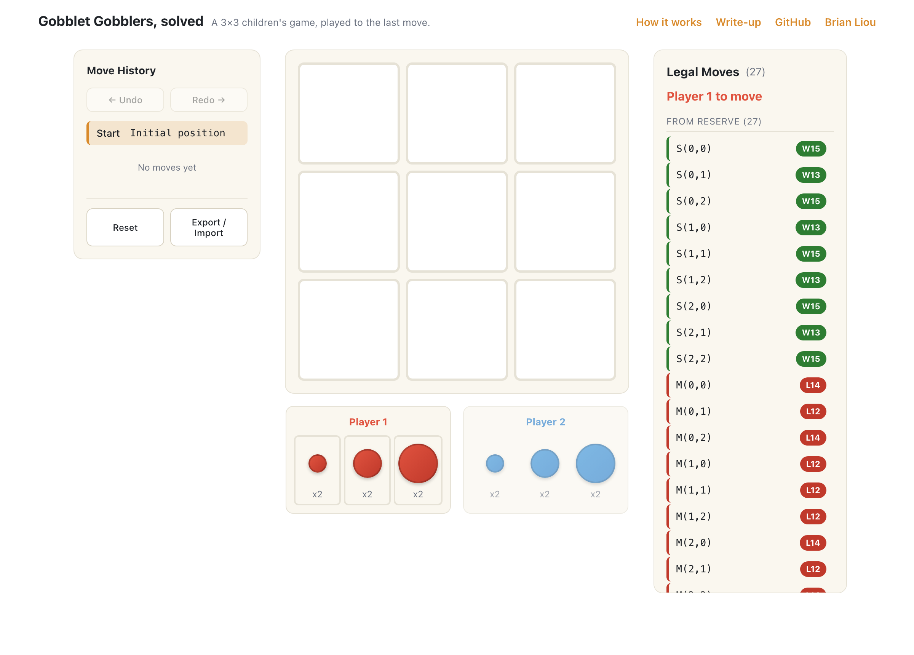

# gobblet-gobblers

<p align="center">
  <a href="https://gobblet.brianhliou.com">
    
  </a>
</p>

**Gobblet Gobblers**, the 3×3 children's game, solved completely — every reachable
position labeled win, loss, or draw with its distance to mate, and explorable in the
browser.

**Live:** explorer → **<https://gobblet.brianhliou.com>** ·
write-up → **<https://brianhliou.com/posts/gobblet-gobblers/>**

Gobblet Gobblers is tic-tac-toe with nesting pieces: each player has six pieces in
three sizes, a larger piece gobbles (covers) a smaller one, and three of your pieces
showing in a row wins. Two rules give it its depth: a piece can be lifted to reveal
whatever it was sitting on, and the board can cycle forever as pieces move on and off
stacks.

## Why this repo exists

The obvious way to solve Gobblet Gobblers — forward minimax with a transposition
table — gives the wrong answer, and most published "solutions" use exactly that. The
game has cycles: pieces move, positions repeat, and the threefold-repetition rule
makes a position's value depend on the history that reached it, not the board alone. A
table keyed on the board caches a value that's only correct for one history and reuses
it for another. That's the **Graph History Interaction (GHI)** problem, and it quietly
corrupts the result.

My first solver had this bug. The corrected solve is a **retrograde analysis**, which
never caches across histories because it works backward from terminal positions. The
original forward solver is kept in [`legacy/forward-solver/`](legacy/forward-solver/)
as the thing being corrected; the write-up walks through how the bug shows up and why
retrograde is sound.

## How it's solved

The solve is a two-phase retrograde analysis in Rust (`solver/`), not taken on faith:

- **Phase 1** enumerates every non-terminal canonical position by breadth-first
  search, folding the board's 8 symmetries (4 rotations × 2 reflections) so
  transpositions collapse to one key. The full game state packs into a **u64**.
- **Phase 2** fills each position's signed distance-to-mate by backward induction to a
  fixpoint — terminals seed it, wins and losses propagate, and **draws fall out as the
  cycle-bound residue** the fixpoint never proves won or lost. ~30 min, peak ~12 GB
  RAM, 14 cores.
- **531.5M reachable** positions; **370.9M non-terminal**, of which 185.4M are
  first-player wins, 185.3M are second-player wins, and draws are rare — 208,563,
  **0.04%** — because gobbling keeps almost every position decisive. The initial
  position is a **first-player win in 13 plies**.
- Packed into a **~531 MB** compact tablebase (minimal perfect hash + one
  signed-distance byte per position) — this is what the live explorer probes, served
  from Railway.
- **Stacking ablation:** re-solving with gobbling disabled collapses the game to
  **~1.4M positions and a 10-ply win** — direct evidence that stacking, not the reveal
  rule, is what makes it deep.

```sh
cd solver
cargo run --release --bin retro -- --selftest
cargo run --release --bin retro -- --save-ctb gobblet.ctb   # full solve: ~30 min, ~12 GB, 14 cores
```

## Layout

```
core/        # game logic: bit-packed board, move generation, win detection — compiles to WASM
solver/      # retrograde solver (src/bin/retro.rs) + analysis tools; cuts the .ctb tablebase
api/         # tablebase probe (Rust / axum): loads the .ctb into RAM, answers batch lookups
explorer/    # interactive web explorer over the solved tablebase (WASM game logic, on Vercel)
legacy/
  forward-solver/   # the original forward minimax — GHI-buggy, preserved for reference, not built
docs/        # rules, state encoding, the GHI correction, game-tree analysis, deployment
assets/      # screenshot
```

## The result, in one paragraph

Gobblet Gobblers is a two-player, zero-sum, perfect-information game, so every position
has a definite value. Enumerating all 370.9M non-terminal positions reachable from the
start and running retrograde analysis (backward induction from terminal positions)
labels each a win, loss, or draw with its distance to mate. The first player wins in 13
plies with perfect play; wins split almost exactly evenly across the position space
(185.4M to 185.3M), and genuine draws are rare (208,563, 0.04%) because gobbling keeps
the board decisive. Being solved doesn't make it unfun to play — the perfect lines run
well past what a person tracks at the table.

## License

Code is released under the [MIT License](LICENSE). The write-up prose is © Brian Liou.
